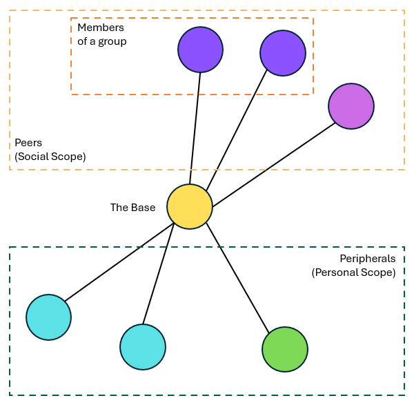
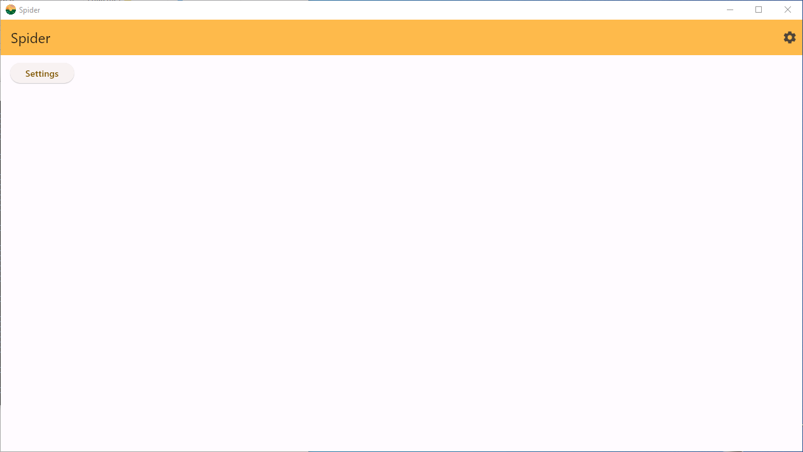
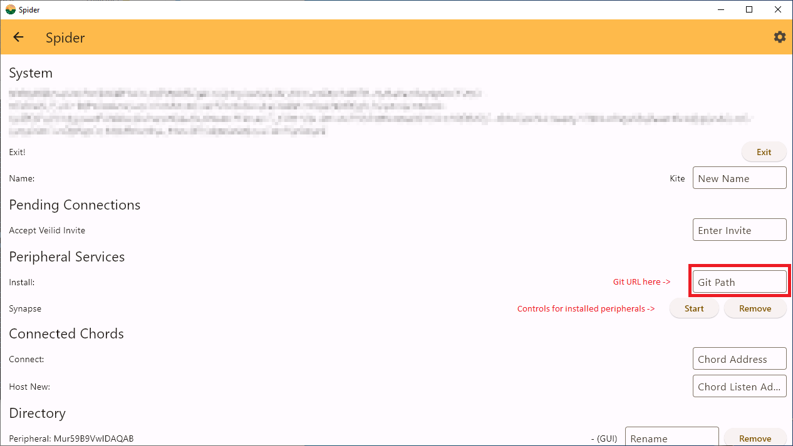

# Spider

[Skip to installation](#requirements) \
[Development Setup](development.md)

This project aims to make the creation of distributed software easier to both
write and use by providing a platform that handles some of the more complex
aspects of coordinating a decentralized system.

Often when building a system with many users, a centralized approach is
easiest to design. However, this design means that the users must give up some
control of the system they use because they cannot control the point of
centralization.

## Architecture

In order to achieve this, the system is organized into several parts. First is
the base which coordinates communication and stores data for the other parts.
Each user has their own base, and for social services these bases must connect
and interact with each other. Other user's bases are called peers. Other devices
that a user owns that connect to their base are called peripherals.

Peripherals can exist in several different forms. A UI peripheral renders the UI
of the base and the UI pages that other peripherals may have registered. A
service peripheral is installed and managed by the base. These are for providing
extra functionality to the system that does not need to run on a separate
machine. A satelite peripheral is runs on some embedded device allowing that
device to receive input and return feedback to the user and the rest of the
system.

The following is a diagram of the system from the perspective of a single user.



## Requirements

This project depends on both [Rust](https://www.rust-lang.org/tools/install) and
[Git](https://git-scm.com/downloads) for both its build process and its
operation.

To effectively interact with the base portion of this project, the
[GUI](https://github.com/Ocelmot/spider_gui) is also needed. The GUI has a
dependency on
[Flutter](https://docs.flutter.dev/get-started/install?gad_source=1&gclsrc=ds).

## Download

To download the required components of this project, use the following git
commands. This guide will assume there is a directory referred to as
`<project_root>` which will be used for downloading and building the project.
Commands will be assumed to run from this directory unless indicated otherwise.

Clone the base.
``` bash
git clone https://github.com/Ocelmot/spider.git spider_base
```

Clone the GUI.
``` bash
git clone https://github.com/Ocelmot/spider_gui.git spider_gui
```

Setup configuration for Rust. To do this create a file
`<project_root>/.cargo/config.toml` which contains the following.
``` toml
[build]
rustflags = ["--cfg", "tokio_unstable"]
```

## Build / Run

The base should be launched first. To build and run it execute the following
```bash
cd <project_root>/spider_base
cargo run
```

To build and run the client execute the following
```bash
cd <project_root>/spider_gui
flutter run
```
At this point, Flutter will prompt for which target to build. Choose your
platform. If you want to build for a mobile device, make sure the device is
plugged in before running this step and then select it from the list.

### Usage

When the client first runs it is not paired with any base. In order to pair with
a base it searches the local network and lists bases it finds. Select the base
from the list and press pair. Since the base has not paired with any peripherals
yet, it will automatically accept the connection. Future connections will
require that the connection is accepted through the GUI settings menu.

Once the client is paired and connected to the base, it will display a list of
UI pages that correspond to connected peripherals. The first in this list is
always the settings menu. Since there are no other peripherals connected, this
should be the only item in the list.



To install a new peripheral service, open the first item in the list, the
settings menu. Under the `Peripheral Services` heading there is an input that
accepts a url to the Git repository that contains service to install. See the
[Peripherals](#peripherals) section below for more information about an example
to install. Installation may take a few moments. Once complete, there should be
an entry below the input that shows the installed services.



Once the peripheral service is installed, press the arrow in the upper left of
the screen to return to the main list of UI pages. If the peripheral service
provides a UI page it will appear under the settings button.

## Peripherals

At the moment, the best example of a peripheral to install is
[Synapse](https://github.com/Ocelmot/Synapse). It is a simple chat app that
operates through the spider platform. Follow the link to learn more.
